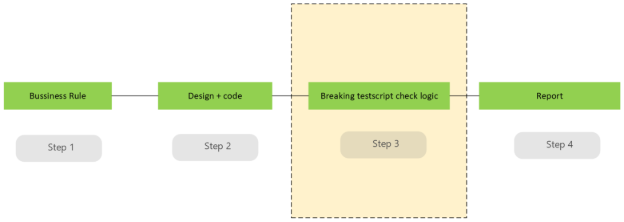

**Data Accuracy Test Rule Engine**

1. **Challenge Owner:** Tran Hong Vinh + 55218 + EDA/DPC

1. **Mentor/Judger of this Challenge:** Tran Hong Vinh + 55218 + EDA/DPC 

1. **Back up for Judger:** Vu Ngoc Anh + 23847 + EDA/DPC, Nguyen Thi Sao Mai + 46875 + EDA/DPC

1. **Challenge Overview**

This is a challenge designed for a Data Engineer, through this challenge we intend to look for a young talent candidate with the skills as mentioned in section 5. Technical Requirements and capabilities to analyze and design an implementable solution to meet the requirements mentioned in this Section. 

**Data Engineering Development & Test Process**

**Business logic rules → Development of Data job(s) and pipeline(s) (Design + code) to process data per business logic rules → Test scripts to check business logic rules** → **Consolidate into data test report** 

**Demand of Data Accuracy Test Rule Engine**

Currently, test scripts in step 3 are being ad-hoc/individually/separately developed to verify specific and complicated business logic rules. 

We need a Data Accuracy Test Rule Engine that will help:

- Support Boolean operators to create complex rules by combining categorized and simplified rules, i.e. a complex rule will be formed from the categorized and simplified rules by a Boolean expression, e.g. <Categorized and simplified rule 1> <BOOLEAN OPERATOR A> <Categorized and simplified rule 2> <BOOLEAN OPERATOR B> <Categorized and simplified rule 3>. The final result of a complex rule will be TRUE or FALSE to demonstrate the logic checking is PASSED or FAILED
- Support the following list of categorized and simplified rules:

|**No**|**Rule types**|**Applied on**|**Description**|**Examples**|
| :-: | :-: | :-: | :-: | :-: |
|1|Value range |A column|Validate data according to expected ranges. |
From… to…

(Refer to 8. Appendix)
|
|2|Value template |A column|Validate regex templates|
Telephone number, email format…

(Refer to 8. Appendix)
|
|3|Data continuity/integrity |A column|Validate the data continuity/integrity|
Timestamp or id in sequence

(Refer to 8. Appendix)

|
|4|Comparison of the same Statistical and Arithmetic calculations|2 groups of columns (in different tables)|Support the same statistical and arithmetic calculation on the 2 groups of columns, then the comparison of results (=, !=, >, <)|
Same min, max, average

(Refer to 8. Appendix)

|
|5|Comparison of different Statistical and Arithmetic calculations|2 groups of columns (in different tables)|Support the different statistical and arithmetic calculation on the 2 groups of columns, then the comparison of results (=, !=, >, <)|
Sum of a group of column = another column

(Refer to 8. Appendix)
|

- **Generate parameterized SQL scripts** to validate every categorized and simplified rule over multiple data tables and columns. Main kinds of parameters include: 
    1. **KEYWORDs** referring to names of functions for Statistical and Arithmetic calculations (including pre-built functions supported by the database engine or user-defined functions loaded into the database engine). *Note: The script of user-defined functions will be out of scope of this rule engine; the SQL scripts generated in this rule engine are to call the functions.*
    2. **NAMEs** referring to specific data objects like schema, table and column following the naming space of the database engine, e.g., referring to a specific column by `<schema>.<table>.<column>`.
    3. **VALUEs** referring to constant values formatted for different data types, including lists, enumerated data or collections compatible with the database engine.

1. **Technical Requirements**

The prototype needs to be compatible with the following tech stack:

(1) Programming Languages: SQL, Python

(2) Supports at least 1 database engines: DB2, PostgreSQL, AWS Redshift, MSSQL, Oracle

1. **Evaluation and Measurement**

Define evaluation criteria and measurement for the prototype product

**Measurement**

<table><tr><th colspan="1" rowspan="2"><b>No</b> </th><th colspan="1" rowspan="2"><b>Measurement</b> </th><th colspan="1" rowspan="2"><b>Detail</b> </th></tr>
<tr></tr>
<tr><td colspan="1" rowspan="2">1 </td><td colspan="1" rowspan="2"><b>Performance</b>  </td><td colspan="1"><b>Processing speed</b>: The time required to execute a set of rules. </td></tr>
<tr><td colspan="1"><b>Latency:</b> The delay in executing rules in real-time</td></tr>
<tr><td colspan="1" rowspan="2">2</td><td colspan="1" rowspan="2"><b>Flexibility</b></td><td colspan="1"><b>Easy rule customization:</b> rules configured by parameters (i.e. without code changes)</td></tr>
<tr><td colspan="1"><b>Rule definition by</b> JSON, XML, SQL stored procedure/function or a description language</td></tr>
<tr><td colspan="1">3</td><td colspan="1"><b>Scalability</b></td><td colspan="1">The engine can handle a large number of rules</td></tr>
</table>

1. **Deliverables** 
- Principle design document 
- Prototype demo (incl. source code and running demo)
1. **Appendix: Examples** 

**Examples of Rules**

Examples of categorized rule type 1:

|**Transaction ID**|**Amount (USD)**|**Expected Range**|**Validation Outcome**|
| :-: | :-: | :-: | :-: |
|1001|500|100 - 10000|✅ Within Range|
|1002|50|100 - 10000|❌ Out of Range|
|1003|7500|100 - 10000|✅ Within Range|
|1004|15000|100 - 10000|❌ Out of Range|

Examples of categorized rule type 2:

|**Column**|**Example Data**|**Expected Outcome**|**Regex Pattern**|
| :-: | :-: | :-: | :-: |
|**Email**|<user@example.com>|✅ Valid|^[a-zA-Z0-9.\_%+-]+@[a-zA-Z0-9.-]+\.[a-zA-Z]{2,}$|
|**Email**|user@.com|❌ Invalid|Same regex as above|
|**Phone (VN - Valid)**|+84 912345678|✅ Valid|^\+84\s?\d{9,10}$|
|**Phone (VN -Valid)**|0912 345 678|✅ Valid|^0\d{9,10}$|
|**Phone (VN - Invalid)**|123456|❌ Invalid|Same regex as above|

Examples of categorized rule type 3:

**Record id = 1, 2, 3, ...**

Examples of categorized rule type 4

The **branch\_code** of **Table A** and **Table B** must have equal values.

Compare: Value of **branch\_code** of **Table A  ==** Value of **branch\_code** of **Table B**

Examples of categorized rule type 5: Overdue Loan Repayments vs. Transaction Totals

Table 1: Overdue Loan Payments

|**Contract\_nbr**|**Overdue\_Principal\_Payment**|**Overdue\_Principal\_Penalty**|**Overdue\_Interest\_Payment**|**Overdue\_Interest\_Penalty**|
| :-: | :-: | :-: | :-: | :-: |
|50001|1000|200|300|50|
|60002|1200|250|400|60|

Table 2: Transaction Summary

|**Contract\_nbr**|**Repayment\_Amount**|
| :-: | :-: |
|50001|1550|
|60002|1910|

Examples of Calculations and Comparisons:

- Calculation: Sum, Average, Min/Max...
- Comparison: equal, not equal, greater than, less than, not greater than, not less than
